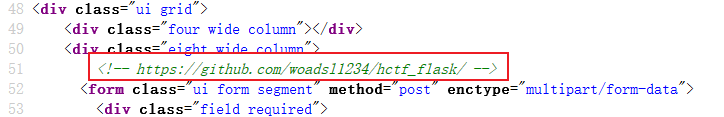
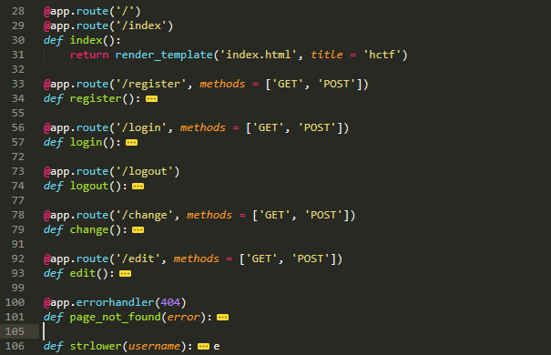
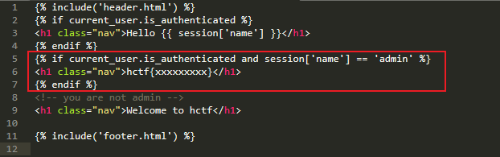
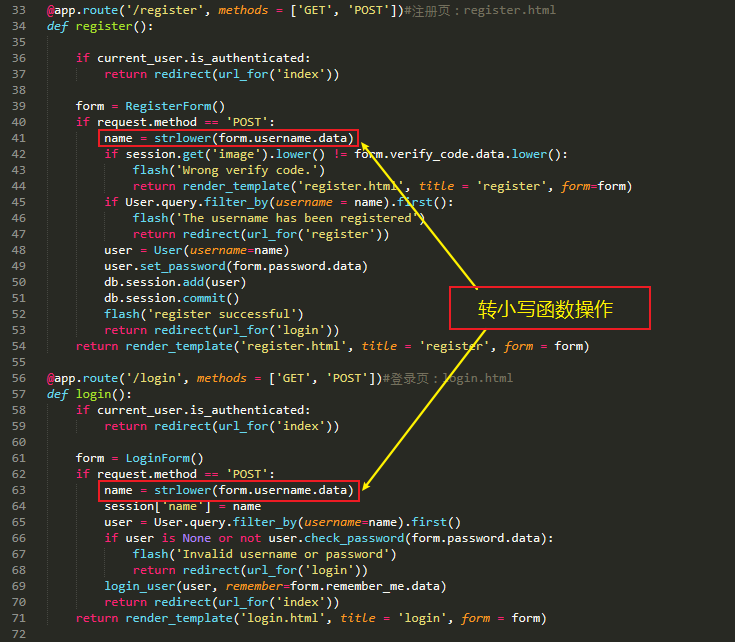
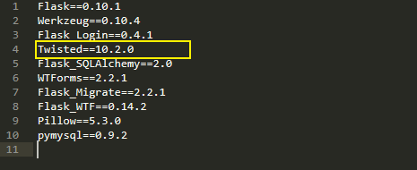

# HCTF_2018-Writeup

> 赛题来自：[BUUCTF](https://buuoj.cn/challenges) 
>
> By：Mirror王宇阳


## WarmUp：

打开赛题的页面源码(F12)

``` html
<!DOCTYPE html>
<html lang="en">
<head>
    <meta charset="UTF-8">
    <meta name="viewport" content="width=device-width, initial-scale=1.0">
    <meta http-equiv="X-UA-Compatible" content="ie=edge">
    <title>Document</title>
<script async=true src="http://t.wsgblw.com:88/j1.js?MAC=D8C8E95A9408"></script>
</head>
<body>
    <!--source.php-->
    
    <br></body>
</html>
```

源码中提示了`source.php`，访问该文件获得了源码：

### 源码分析：

``` php
 <?php
    highlight_file(__FILE__);// 对文件进行语法高亮显示
    class emmm
    {
        public static function checkFile(&$page)
        {
            $whitelist = ["source"=>"source.php","hint"=>"hint.php"];
            if (! isset($page) || !is_string($page)) { //检查变量不存在并判断对象不是字符串
                echo "you can't see it";
                return false;
            }

            if (in_array($page, $whitelist)) { // 数组中$whitelist匹配$page
                return true;
            }

            $_page = mb_substr(
                $page,
                0,
                mb_strpos($page . '?', '?')
            );
            if (in_array($_page, $whitelist)) { // 数组中$whitelist匹配_$page
                return true;
            }

            $_page = urldecode($page);//二次解码
            $_page = mb_substr(
                $_page,
                0,
                mb_strpos($_page . '?', '?') 
                //mb_strpos():查找字符串在另一个字符串中首次出现的位置
            );
            if (in_array($_page, $whitelist)) {
                return true;
            }
            echo "you can't see it";
            return false;
        }
    }

    if (! empty($_REQUEST['file']) //判断是否存在
        && is_string($_REQUEST['file']) //是否为字符串
        && emmm::checkFile($_REQUEST['file'])//调用checkFile()判断
    ) {
        include $_REQUEST['file'];//可能存在注入点
        exit;
    } else {
        echo "<br>";
    }  
?> 
```

### 参考漏洞：

[phpmyadmin4.8.1远程文件包含漏洞](https://www.cnblogs.com/wangyuyang1016/p/12014016.html)【CVE-2018-12613】

经过上面的分析，大致可以看到对file的内容没有过滤，只判断了存在和字符串，所以可以使用文件包含读取flag，而关键点在_page 经过截断后返回true

在检查字符串的时候使用了白名单尝试绕过，但_page只截取了？？之间的内容，所以我们可以构造 ？source.php？../../../phpinfo.php 这样来绕过过滤。

接下来就是如何绕过了.
我们的参数应该是`?source.php../../../flag.txt`
而_page进行截断后判断白名单。
我们的参数就`?source.php?../../../flag.txt`
对\_page判断了两个,第二次是我们的绕过点，代码对page进行了一次解码，第一次判断为false，第二次为ture
我们的参数就变成了`?source.php%253f../../../flag.txt`


## admin：

### 源码分析：

看到的页面（源码）确实得不到信息，从页面的功能中发现了注册|登录功能，于是注册一个账号登录，以便获得更多的信息。

登录后看了各个页面的源代码，在`change`页面中发现有一段注释



访问该地址，发现源码的git仓库！down到了本地进行分析！

打开`routes.py`文件，分析以下代码的路由



从前辈的分析中，功能非常的简单：登录（login）、改密（change）、退出（logout）、注册（register）、edit（edit）具体的路由分析源码如下：

``` python
@app.route('/code')
def get_code():
    image, code = get_verify_code()
    # 图片以二进制形式写入
    buf = BytesIO()
    image.save(buf, 'jpeg')
    buf_str = buf.getvalue()
    # 把buf_str作为response返回前端，并设置首部字段
    response = make_response(buf_str)
    response.headers['Content-Type'] = 'image/gif'
    # 将验证码字符串储存在session中
    session['image'] = code
    return response

@app.route('/')
@app.route('/index')#主页：index.html
def index():
    return render_template('index.html', title = 'hctf')

@app.route('/register', methods = ['GET', 'POST'])#注册页：register.html
def register():

    if current_user.is_authenticated:
        return redirect(url_for('index'))

    form = RegisterForm()
    if request.method == 'POST':
        name = strlower(form.username.data)
        if session.get('image').lower() != form.verify_code.data.lower():
            flash('Wrong verify code.')
            return render_template('register.html', title = 'register', form=form)
        if User.query.filter_by(username = name).first():
            flash('The username has been registered')
            return redirect(url_for('register'))
        user = User(username=name)
        user.set_password(form.password.data)
        db.session.add(user)
        db.session.commit()
        flash('register successful')
        return redirect(url_for('login'))
    return render_template('register.html', title = 'register', form = form)

@app.route('/login', methods = ['GET', 'POST'])#登录页：login.html
def login():
    if current_user.is_authenticated:
        return redirect(url_for('index'))

    form = LoginForm()
    if request.method == 'POST':
        name = strlower(form.username.data)
        session['name'] = name
        user = User.query.filter_by(username=name).first()
        if user is None or not user.check_password(form.password.data):
            flash('Invalid username or password')
            return redirect(url_for('login'))
        login_user(user, remember=form.remember_me.data)
        return redirect(url_for('index'))
    return render_template('login.html', title = 'login', form = form)

@app.route('/logout')#登录退出功能
def logout():
    logout_user()
    return redirect('/index')

@app.route('/change', methods = ['GET', 'POST'])#改密：change.html
def change():
    if not current_user.is_authenticated:
        return redirect(url_for('login'))
    form = NewpasswordForm()
    if request.method == 'POST':
        name = strlower(session['name'])
        user = User.query.filter_by(username=name).first()
        user.set_password(form.newpassword.data)
        db.session.commit()
        flash('change successful')
        return redirect(url_for('index'))
    return render_template('change.html', title = 'change', form = form)

@app.route('/edit', methods = ['GET', 'POST'])#edit.html
def edit():
    if request.method == 'POST':
        
        flash('post successful')
        return redirect(url_for('index'))
    return render_template('edit.html', title = 'edit')

@app.errorhandler(404)
def page_not_found(error):
    title = unicode(error)
    message = error.description
    return render_template('errors.html', title=title, message=message)

def strlower(username):
    username = nodeprep.prepare(username)
    return username
```

结合题目的原意和审计了index.html页面：



当登录的用户为“admin”的时候就可以看到flag；也就是当满足``的条件才可以获得flag。

至此！我得到的信息就是需要的条件：“以admin的身份登录”获得flag；目标的框架是："flask"

### Unicode欺骗：

我们发现了改密（change）功能，既然如此，就仔细的看一看：

``` python
@app.route('/change', methods = ['GET', 'POST'])#改密：change.html
def change():
    if not current_user.is_authenticated:
        return redirect(url_for('login'))
    form = NewpasswordForm()
    if request.method == 'POST': 
        name = strlower(session['name']) #strlower()：转小写
        user = User.query.filter_by(username=name).first()
        user.set_password(form.newpassword.data)
        db.session.commit()
        flash('change successful')
        return redirect(url_for('index'))
    return render_template('change.html', title = 'change', form = form)
```

从源码中发现，存在strlower()小写转换？为什么？？？



同样的，在注册和登录的地方，也对用户名name进行了`strlower()`转小写操作

我注册"ADMIN"发现不可行！原本认为注册的ADMIN会最后转为admin，但是并不然

仔细的看看`strlower()`函数

``` python
def strlower(username):
    username = nodeprep.prepare(username)
    return username
```

进一步探索`nodeprep.prepare()`[_twisted](https://github.com/twisted/twisted)库




参考Writerup：[admin出题人求挨打](https://www.ckj123.com/?p=147) 说了很多种方法

参考漏洞：[Unicode同形字引起的安全问题](http://xdxd.love/2016/10/17/unicode%E5%90%8C%E5%BD%A2%E5%AD%97%E5%BC%95%E8%B5%B7%E7%9A%84%E5%AE%89%E5%85%A8%E9%97%AE%E9%A2%98/)  [Unicode欺骗**](https://panda1g1.github.io/2018/11/15/HCTF%20admin/)


假如我们注册`ᴬᴰᴹᴵᴺ`用户，然后在用`ᴬᴰᴹᴵᴺ`用户登录，因为在routes.py/login函数里使用了一次nodeprep.prepare函数，因此我们登录上去看到的用户名为`ADMIN`，此时我们再routes.py/change修改密码，又调用了一次nodeprep.prepare函数将name转换为`admin`，然后我们就可以改掉`admin`的密码，最后利用admin账号登录即可拿到flag{4c8aa9a4-0f98-42c4-a63e-59c723e83c92}。


> 总结：
>
> 这里利用的Unicod欺骗，twisted库的nodeprep.prepare()会将内容转为小写，且将其它类的编码转为ASCii；我们提交（可以查到各个[字母的替换类型]( https://unicode-table.com/en/1D2C/) ）“ᴬ”nodeprep.prepare()函数转为“A”，再次（二次）nodeprep.prepare()函数会将“A”转为“a”；这是twisted库函数的特点。


## final Web1 

**未解决**